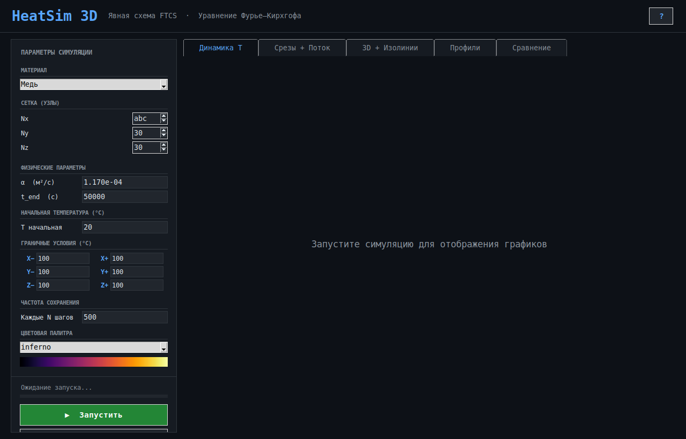
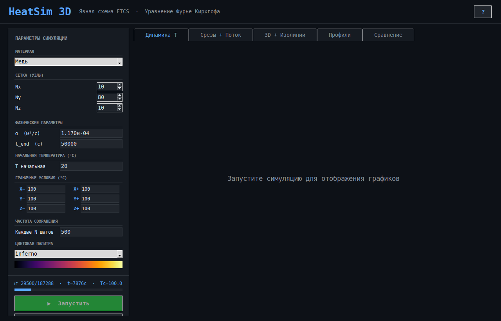

# Отчёт о тестировании программного комплекса HeatSim3D

## 1. Объект тестирования

**HeatSim3D** — программный комплекс для моделирования нестационарной теплопроводности
в трёхмерном твёрдом теле (явная конечно-разностная схема FTCS, уравнение
Фурье–Кирхгофа). Состоит из двух компонентов:

- **`heat3d.cpp` → `heat3d.exe`** — расчётное ядро на C++: принимает параметры через
  аргументы командной строки, считает температурное поле, пишет результаты в CSV
  (`output/history.csv`, `output/slice_z_step*.csv`, `output/slice_y_step*.csv`).
- **`gui.py`** — графический интерфейс на Python/Tkinter: собирает параметры от
  пользователя, запускает `heat3d.exe` как подпроцесс, разбирает его stdout по
  регулярным выражениям, читает CSV через pandas и строит графики (matplotlib).

Тестирование проведено в три этапа: модульное → интеграционное → системное,
как и предписано методикой. Раздел «Контрольные вопросы» в отчёт не включён по
договорённости — на него отвечает автор лабораторной работы самостоятельно.

Все тестовые скрипты и артефакты лежат в каталоге `tests/` рядом с этим отчётом:

```
tests/
├── unit/         — модульные тесты (C++ и Python)
├── integration/  — интеграционные тесты
└── system/       — сценарий системного теста + скриншоты + лог консоли
```

**Особенность окружения.** `heat3d.exe` собран под Windows (использует
`<direct.h>`), а тестирование выполнялось на Linux. Для тестов ядро было
пересобрано под Linux **той же логикой, без единой смысловой правки** —
заменены только `<direct.h>` → `<sys/stat.h>` и `_mkdir()` → `mkdir()`
(см. `tests/integration/test_integration.py`, шапка файла). Сам факт, что
это потребовалось, зафиксирован как отдельная проблема ниже (П-1.4).

---

## 2.1. Модульное тестирование

**Что тестировалось:** отдельные функции ядра `heat3d.cpp` (`idx`, `computeStableDt`,
`centerTemp`, `meanTemp`, `parseArgs`) и чистая логика GUI (`resource_path`,
`find_exe`, `_build_cmd`) — изолированно, без запуска всей программы.

**Инструменты:** g++ 13 (компиляция тестов вручную, без фреймворка), Python 3 +
встроенный `tkinter` (для проверки виджетов без полноценного окна).

**Файлы:** `tests/unit/test_heat3d_units.cpp`, `tests/unit/test_gui_units.py`.

### Результаты — тесты корректности

| № | Проверка | Результат |
|---|---|---|
| U1 | `idx()` — перевод 3D-координат в линейный индекс | OK (4/4) |
| U2 | `computeStableDt()` — критерий устойчивости Куранта < 1 | OK (2/2) |
| U3 | `centerTemp()` / `meanTemp()` на сетке 3×3×3 | OK (2/2) |
| U4 | `parseArgs()` — корректный разбор известных флагов | OK (2/2) |
| U5 | `resource_path()`, `find_exe()`, `_build_cmd()` (Python) | OK (5/5) |

Всего 15/15 проверок корректности подтвердили ожидаемое поведение.

### Найденные проблемы (модульный уровень)

**П-1.1. `meanTemp()` не защищена от пустого массива.**
`meanTemp({})` возвращает `NaN` (деление `0.0/0`) без какого-либо сообщения об
ошибке. В реальном коде это не встречается (сетка всегда ≥ 3×3×3), но функция
не содержит защиты и могла бы использоваться повторно в другом контексте.

**П-1.2. `parseArgs()` аварийно завершает программу при нечисловом значении параметра.**
Вызов `heat3d.exe --nx abc` приводит к необработанному исключению
`std::invalid_argument` из `std::stoi()`. В `main()` исключение нигде не
перехватывается → программа падает (`std::terminate`) без понятного
пользователю сообщения об ошибке ввода.

**П-1.3. Флаг без значения в конце командной строки молча игнорируется.**
`heat3d.exe --t_end 9000 --nx` (без значения после `--nx`) — условие цикла
`i < argc - 1` не проверяет последний токен, флаг тихо отбрасывается,
используется значение по умолчанию без единого предупреждения.

**П-1.4. Непереносимый код: `<direct.h>`/`_mkdir()` — Windows-only, без запасного варианта.**
Обнаружено на этапе подготовки тестов: `heat3d.cpp` не собирается на Linux/macOS
без правок. Для CI/кросс-платформенной разработки это ограничение.

**П-1.5 (Python/GUI). `_get_params()` перехватывает только `ValueError`, но не `TclError`.**
Если в поле Nx оказывается нечисловой текст, `tk.IntVar.get()` бросает
`_tkinter.TclError`, который не является `ValueError` и потому не ловится
блоком `except ValueError` в `gui.py:428`. Подробно и с воспроизведением на
уровне UI — см. системное тестирование, П-3.1.

---

## 2.2. Интеграционное тестирование

**Что тестировалось:** стык между C++-ядром и Python-GUI — формирование
командной строки, запуск подпроцесса, разбор его stdout регулярными
выражениями из `gui.py`, чтение сгенерированных CSV через pandas.

**Инструменты:** Python 3, `subprocess`, `pandas`, реальный `gui.py` (импортирован
как модуль, использован его настоящий код `_build_cmd`), реально скомпилированное
ядро `heat3d_linux`.

**Файл:** `tests/integration/test_integration.py`.

### Результаты — тесты корректности

| № | Проверка | Результат |
|---|---|---|
| I1 | Регулярка `Steps\s*:\s*(\d+)` извлекает `total_steps` из реального stdout | OK |
| I2 | Расчёт процента прогресса по строкам `step=...` | OK |
| I3 | `history.csv`, сгенерированный C++, читается pandas с ожидаемыми колонками | OK |
| I4 | Число строк в `history.csv` соответствует `save_every` | OK |

### Найденные проблемы (интеграционный уровень)

**П-2.1. Оценка «числа файлов» в GUI не учитывает `Ny`/`Nz` — дублирование формулы вразнобой с C++.**

В `gui.py` (`_start_sim`, строки ~481–484) шаг по времени оценивается заново,
дублируя `computeStableDt()` из `heat3d.cpp`, но **только по `Nx`**:

```python
dx = 1.0 / (p["nx"] - 1)
dt_est = 0.4 / (2.0 * p["alpha"] * 3.0 / (dx*dx))
```

Реальная формула в C++ использует `dx`, `dy`, `dz` независимо. Для несимметричной
сетки это даёт совершенно разные результаты:

| Сетка | Оценка GUI (файлов) | Реально создано файлов | Расхождение |
|---|---|---|---|
| Nx=Ny=Nz=30 | 17 | 34 (17 сохр. × 2 среза) | ожидаемо (оценка = число сохранений) |
| Nx=10, Ny=80, Nz=10 | **2** | **82** (41 сохр. × 2 среза) | **в ~40 раз** |

Следствие: диалог-предупреждение «Много файлов» (`gui.py:485-495`) не
срабатывает именно там, где он нужнее всего — на вытянутых/несимметричных
сетках, — и пользователь неожиданно получает в разы больше файлов и времени
расчёта, чем ему обещал интерфейс.

**П-2.2. Если `save_every` больше числа шагов, сохраняется только начальное состояние.**

Условие сохранения в C++ (`heat3d.cpp:166`) — `step % save_every == 0` — а
цикл завершается по `break` на `step == NSTEPS`, минуя дополнительное
сохранение. Если `save_every` больше `NSTEPS`, единственное успешное
попадание в `% == 0` — это `step = 0`.

Проверено: `t_end=5000`, `nx=ny=nz=15`, `save_every=500` (значение по
умолчанию в GUI!) → `NSTEPS = 189 < 500` → в `history.csv` **одна строка**
(начальные условия), настоящий результат расчёта (состояние на `t=5000`)
нигде не сохранён. При этом движок завершается с кодом `0` («успех»), GUI
не показывает никакой ошибки.

---

## 2.3. Системное тестирование

**Что тестировалось:** полностью собранное приложение как единое целое —
реальное окно Tkinter на экране, реальный запуск `heat3d.exe`-подобного
процесса, реальные графики, реальные диалоговые окна. Тест написан как
скрипт (`tests/system/system_test_driver.py`), управляющий тем же самым,
неизменённым `gui.py` через штатные объекты Tkinter (`Var.set()`,
`button.invoke()`) — так же, как это делает пользователь мышью и клавиатурой,
— и делающий скриншоты через `ImageMagick import` в процессе выполнения.

**Файлы:** `tests/system/system_test_driver.py`,
`tests/system/driver_console_log.txt` (консольный вывод, включая трассировку
необработанного исключения), `tests/system/screenshots/*.png` (13 скриншотов).

### Сценарий и результаты

| Шаг | Действие | Скриншот | Результат |
|---|---|---|---|
| 1 | Запуск приложения | `01_start_window.png` | OK — окно построено корректно |
| 2 | Выбор материала «Медь» | `02_material_med_alpha_updated.png` | OK — α обновилось автоматически |
| 3 | В поле Nx вписан текст `"abc"`, нажата «Запустить» | `03a…`, `03b_after_run_click_with_bad_nx_no_reaction.png` | **ОШИБКА (П-3.1)** |
| 4 | Сетка 10×80×10 (несимметричная), «Запустить» | `04a…`, `04b_after_run_click_no_warning_dialog.png` | **ОШИБКА (П-3.2)** |
| 5 | Ожидание завершения асимметричного расчёта | `05_asymmetric_run_done.png` | OK — расчёт завершился успешно |
| 6–10 | Штатный расчёт 30×30×30, все вкладки графиков | `06…10*.png` | OK — все графики отрисованы корректно |
| 11 | `heat3d.exe` временно скрыт, нажата «Запустить» | `11_missing_exe_error_dialog.png` | OK — показано понятное сообщение |

### Найденные проблемы (системный уровень)

**П-3.1. Нечисловой текст в поле Nx → приложение молча ничего не делает.**

Это тот же дефект, что и П-1.5, но подтверждённый на уровне полноценного
работающего приложения, а не изолированной функции. Пользователь стирает
число в поле Nx, печатает `"abc"`, нажимает «Запустить»:



Кнопка не блокируется, прогресс-бар не двигается, никакого диалога с ошибкой
не появляется — внешне выглядит так, будто клик по кнопке вообще не сработал.
В консоли (`tests/system/driver_console_log.txt`) при этом виден необработанный traceback:

```
_tkinter.TclError: expected floating-point number but got "abc"
  File ".../gui.py", line 432, in _get_params
    "nx":         int(self.nx_var.get()),
```

Причина: `_get_params()` (`gui.py:428-445`) перехватывает только `ValueError`,
а `tk.IntVar.get()` на нечисловом содержимом бросает `_tkinter.TclError` —
другой класс исключений, который проходит мимо `except`. При этом для
**текстовых** полей (например, если вписать текст в `T начальная`, которое
хранится как `StringVar` и парсится через `float()`) `ValueError`
перехватывается корректно и пользователь видит диалог «Неверный формат» —
то есть обработка ошибок ввода в приложении непоследовательна: зависит от
того, `IntVar` это или `StringVar` под капотом, а не от того, что видит
пользователь на экране (оба выглядят как обычное текстовое поле).

**П-3.2. Диалог «Много файлов» не срабатывает для несимметричной сетки.**

Сетка Nx=10, Ny=80, Nz=10, материал «Медь» (α=1.17·10⁻⁴), нажата «Запустить»:



Расчёт молча стартует без предупреждения (виден прогресс-бар «29500/187288»
в левом нижнем углу), хотя по интеграционным тестам (П-2.1) для такой сетки
реально создаётся на порядок больше файлов среза, чем предсказывает GUI. Это
пользовательский сценарий того же корневого дефекта П-2.1, но замеченный
именно там, где его должен ловить UI, — до того, как начнётся долгий расчёт.

**Позитивный контроль.** Сценарий «`heat3d.exe` не найден» отработал
правильно — GUI показывает понятный диалог `Положите heat3d.exe в ту же
папку что и gui.py` (`tests/system/screenshots/11_missing_exe_error_dialog.png`),
не падает и не зависает. Это подтверждает, что обработка ошибок в принципе
предусмотрена в коде — просто не для всех сценариев одинаково полно
(см. П-3.1).

---

## 3. Сводная таблица найденных проблем

| ID | Этап | Проблема | Серьёзность |
|---|---|---|---|
| П-1.1 | Модульное | `meanTemp()` на пустом массиве → NaN без сообщения | Низкая |
| П-1.2 | Модульное | `parseArgs()` падает на нечисловом значении (необработанное исключение) | Средняя |
| П-1.3 | Модульное | Флаг без значения в конце CLI молча игнорируется | Низкая |
| П-1.4 | Модульное | Непереносимый код (`<direct.h>`, Windows-only) | Низкая (инфраструктурная) |
| П-2.1 / П-3.2 | Интеграционное / Системное | Оценка «много файлов» в GUI не учитывает Ny/Nz, ошибается на порядок | **Высокая** |
| П-2.2 | Интеграционное | `save_every` > числа шагов → сохраняется только t=0, финал расчёта теряется | Средняя |
| П-1.5 / П-3.1 | Модульное / Системное | Нечисловой текст в Nx/Ny/Nz не обрабатывается (`TclError` не перехватывается) | **Высокая** |

Итого: 7 уникальных проблем, при требуемом минимуме 2 на каждом из трёх этапов
(модульный — 5, интеграционный — 2, системный — 2, с учётом дублирования
корневых причин между этапами).

## 4. Контрольные вопросы

*Раздел не заполняется в этом отчёте — заполняется автором работы отдельно.*

## 5. Выводы

Компонент-ядро (`heat3d.cpp`) корректно реализует численную схему (критерий
устойчивости соблюдается, индексация и агрегирующие функции работают верно),
но не проверяет пользовательский ввод: некорректные аргументы командной
строки приводят либо к падению программы, либо к тихому игнорированию.
GUI (`gui.py`) в целом успешно решает свою задачу — весь штатный сценарий
(выбор материала → запуск → пять вкладок графиков) отработал без единого
сбоя, — но обработка ошибок ввода непоследовательна (`ValueError` ловится,
`TclError` — нет), а предупреждение о большом числе выходных файлов основано
на формуле, продублированной из C++-ядра с потерей части параметров (Ny, Nz),
из-за чего не срабатывает именно в том случае, для которого создавалось.
Наиболее приоритетные к исправлению — П-2.1/П-3.2 и П-1.5/П-3.1, как
подтверждённые сразу на двух уровнях тестирования и способные напрямую
ухудшить пользовательский опыт без каких-либо сообщений об ошибке.
